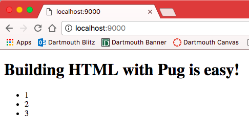
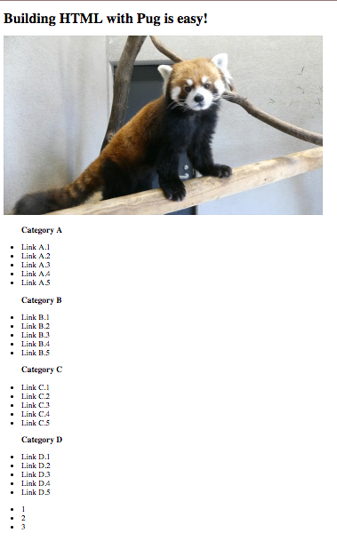

# Pug Workshop

[Pug](https://pugjs.org/), formerly known as Jade, is a preprocessor for HTML and a Node.js templating engine implemented with Javascript. It is the number one

## Instructions
To complete this workshop, follow the following steps:

1. [Fork the repository](#fork-the-repo)
2. [Install pug](#install-pug)
3. [Start a pug file](#start-a-pug-file)
4. [Serve your first project](#serving-your-project-on-a-browser)
5. [Spice up your website](#spice-up-your-website)
6. [Variables and Conditionals](#adding-variables-and-conditionals)
7. [Let's add a navbar](#add-a-navbar)
8. [Build the sitemap](#building-the-sitemap)
9. [Modify the Footer](#modify-the-footer)
10. [Style the site](#style-your-webpage)

Be sure to look out for the following notations:
* :computer: run in terminal
* :rocket: this is a key step

## Fork the Repo
:rocket: First, make sure to fork [this](https://github.com/yeonjaepark/pug-workshop) repo and clone it to your computer so we can get started!


## Install Pug
Then, in your new repository, install Pug. We will be working with [Pug's CLI interface](https://www.npmjs.com/package/pug-cli) so that we can run the files without a server.

:computer: Install pug from your command line.
```
npm install pug-cli -g
```
This installs the package globally so the node-modules file is no longer needed.

## Start a Pug File
We will be working in a .pug file, so let's create a index.pug file!

:computer: Create an index pug file.
```
touch index.pug
```
Or if you're using Windows...
```
atom index.pug
```
One of the main advantages of using Pug is that the syntax is very clean and simple. Rather than dealing with the XML styling of HTML with all the tags, we can simply write p or h1 to specify how to format the content.

Let's start with a very simple Hello World!

:rocket: Start by adding a beginning header to the pug file. It looks just like an html file, but simpler (no closing tags are needed, for example).
```
doctype html
html
  head
  body
```

Now, let's add in "Hello World!" to your body!

:warning: Remember: indents are crucial for nesting in pug.

:rocket: Add the text under body.
```
h1 Hello world!
```

## Serving your project on a browser
With our new pug file, we can now compile it into an HTML file and host it locally to see our work so far. It is very simple to render our pug file into an HTML file.

:computer: Run the following command.
```
pug -P -w index.pug
```
The -P tag will format the HTML file to include whitespaces while the -w tag allows for automatic re-rendering every time you update your index.pug file. Take a look at your new html file, which should be called index.html. :thumbsup:

:computer: Now, let's host it locally by running the following familiar command.
```
python -m SimpleHTTPServer 9000
```
Visit http://localhost:9000/ and there you have it!
Your site should look something like this:


## Spice up your website
Let's make our website more interesting. Instead of having Hello World, let's change this to be a callout. In Pug, if there are no specified tags, it is assumed that you are creating a div. First, create a div with the class as main and under that div, let's create a div with class callout. To write classes and IDs, we write it the same way as in a css file, .class and #ID.

:rocket: Add the following to your body.
```
.main
  .callout
    h1 Building HTML with Pug is easy!
```

:rocket: Next, try adding a footer as an unordered list with three items under the main class. To do so, use the footer tag, the ul tag, and the li tag.
```
.footer
  ul
    li 1
    li 2
    li 3
```
Your page should look like this now:



## Adding variables and conditionals

One of the cool things about using Pug is that we can add in conditionals. Inside your pug file, you can add in if-else statements in addition to using variables. If you look at the options.js file that we have given you, we have a variable happy that has a boolean as a value. Now, we can use this so that if happy, we display one image, otherwise, display a different image.

:rocket: Try adding this to your callout under h1.
```
if happy
  img(src="https://i.imgur.com/AV83fzb.gif")
else
  img(src="https://i.imgur.com/rG0fW29.gif")
```
Since we are now using the javascript file that stores all the variables and data, we want to add a tag when we render our HTML file so that it knows to look at the javascript file to look for data. Similar to what we have been doing, we just need to add an options switch.

:computer: Run the following command.
```
pug -P -O options.js index.pug
```

Your page should now look like this:


:rocket: Now go into options.js and change happy to true, then reload your page and see what happens.

## Add a navbar
Another advantage of using pug is that you can use other templates that you have created and just put them into your pug file! You may have noticed that there is another pug file in the templates folder, navigation.pug. This file has the navigation template that we have created for you.

:rocket: Add this navigation template above your callout div.
```
include templates/navigation.pug
```
Right now, your nav bar only has a list. How about adding a logo? Adding images to your webpage is really easy with pug.

:rocket: Add this line above the unordered list in your navigation file.
```
img(src="images/icon.svg", alt='icon')
```

## Modify the footer

Let's add some helpful links to the footer!

:rocket: Before your unordered list in your footer, add in a span with some links using the a tag. To let the dash appear, we need to escape it, so add in a pipeline before the dash.

```
span
  a(href="https://github.com/yeonjaepark/pug-workshop/") Pug Workshop
  | -
  a(href='http://cs52.me') CS 52
```


## Building the sitemap
Like what we did in our first lab, we will be creating some headers and links. Unlike writing everything out in HTML over and over again like we did in Lab 1, with Pug, we can just iterate through a list.

In your options.js file, we have given you some data that you will be using in this next section. We have given you a list, sitemap, that has some headers and links for each category.

By iterating through the sitemap, we can create an unordered list for each category so that the list starts with a header and then has the links that go with each header. It should look similar to what you had for Lab 1.

:rocket: Create a new div with the class sitemap after your callout div and go through each item in the list sitemap, extracting the header and then looping through the links.

```
.sitemap
  each category in sitemap
    ul
      li
        h3!= category.header
      each link in category.links
        li
          a(href=link.url)= link.name
```

Your page should look something like this:



:rocket: Go into your options.js and try changing around the variables. Then re-render your html and host your site to see your changes!


## Style your webpage
Finally, let's add some styling to the site!! We have given you a CSS file; all you have to do is link it to your pug file! First, let's link a font from google fonts.

:rocket: At the top of your pug file under head, link in your fonts and css.

```
link(rel='stylesheet', href='styles.css')
link(href='https://fonts.googleapis.com/css?family=Amatic+SC:400,700', rel='stylesheet')
```

And there you have it!

## Checklist
:white_check_mark: Installed pug and served a Hello World! page with pug.

:white_check_mark: Used variables and conditionals in pug file.

:white_check_mark: Linked navbar template to pug file and added logo.

:white_check_mark: Built the sitemap using loops in pug file.

:white_check_mark: Optional: style the page some more!
